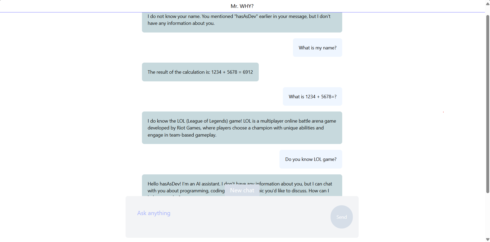

# Project name: simple_chatbot_web_app
This is a website application of an AI-powered conversational chatbot.
However, the app has been in an experiment, so it is one-to-one usage between a user and the chatbot. 

The base model is Llama-3.2-1B-Instruct developed by Meta (see more on [Llama-3.2-1B-Instruct on Hugging face](https://huggingface.co/meta-llama/Llama-3.2-1B-Instruct).)

# Demo (read down to top)


# Features
**Real-time responses**: User can make a real-time conversation with the chatbot.

**Memory system**: The chatbot has a memory of the chat conversation.

*Note*: I haven't improved a RAG system yet. I will do this in the future.

# Tech Stack
**Back-end:** 
- Django 5.1.7 
- Daphne 4.1.2

**Front-end:**
- ReactJs 19.1.0
- TailwindCss

**AI/Machine learning frameworks:**
- Transformers 4.50.3
- Langchain 0.3.22

# How to run locally
Step-by-step guide:
1. Clone the repository.
```
git clone https://github.com/hasAsDev/simple_chatbot_web_app.git
cd simple_chatbot_webapp\mrwhy\
```
2. Run the app using django-daphne server.
```
py manage.py runserver
```
3. Go to http://127.0.0.1:8000/.

# Licenses
**MIT LICENSE**: see more on [MIT LICENSE](https://choosealicense.com/licenses/mit/).

**LLAMA 3.2 COMMUNITY LICENSE**: see more on [LLAMA 3.2 COMMUNITY LICENSE](https://github.com/meta-llama/llama-models/blob/main/models/llama3_2/LICENSE).